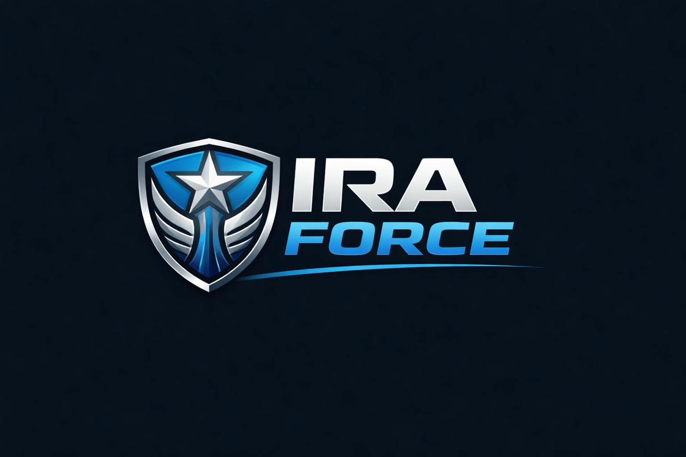

# IRA FORCE India - Security Workforce Management Platform



A modern, animated React website for IRA FORCE - India's premier security workforce management platform. Built with React, Vite, Tailwind CSS, and Framer Motion.

## 🚀 Features

- **Modern Design**: Elegant dark theme with cyan/gold accents matching IRA FORCE brand
- **Smooth Animations**: Framer Motion powered animations including:
  - Magnetic buttons (ReactBits inspired)
  - Scroll-triggered reveals
  - Floating particles background
  - Staggered content loading
  - Parallax effects
- **Responsive**: Mobile-first design that works beautifully on all devices
- **Performance Optimized**: Built with Vite for lightning-fast builds
- **SEO Ready**: Meta tags, Open Graph, and semantic HTML

## 📦 Tech Stack

- **React 18** - UI Library
- **Vite 5** - Build Tool
- **Tailwind CSS 3** - Styling
- **Framer Motion** - Animations
- **Lucide React** - Icons
- **React Intersection Observer** - Scroll animations

## 🛠️ Local Development

### Prerequisites

- Node.js 18+ installed
- npm or yarn

### Installation

```bash
# Clone the repository
git clone https://github.com/yourusername/iraforce-india.git

# Navigate to project directory
cd iraforce-india

# Install dependencies
npm install

# Start development server
npm run dev
```

The site will be available at `http://localhost:5173`

### Build for Production

```bash
npm run build
```

Built files will be in the `dist` folder.

## 🚀 Deployment to GitHub Pages

### Automatic Deployment (Recommended)

The repository includes a GitHub Actions workflow that automatically deploys to GitHub Pages when you push to the `main` branch.

1. **Enable GitHub Pages in Repository Settings:**
   - Go to Settings → Pages
   - Under "Build and deployment", select "GitHub Actions"

2. **Push your code:**
   ```bash
   git add .
   git commit -m "Initial commit"
   git push origin main
   ```

3. **Wait for deployment:**
   - Go to Actions tab to see deployment progress
   - Once complete, your site will be live at: `https://yourusername.github.io/iraforce-india/`

### Manual Deployment

```bash
# Build and deploy manually
npm run build
npm run deploy
```

## 📁 Project Structure

```
iraforce-india/
├── public/
│   └── logo.jpeg           # IRA FORCE logo
├── src/
│   ├── App.jsx             # Main application component
│   ├── index.css           # Global styles + Tailwind
│   └── main.jsx            # Entry point
├── .github/
│   └── workflows/
│       └── deploy.yml      # GitHub Actions workflow
├── index.html              # HTML template
├── package.json            # Dependencies
├── vite.config.js          # Vite configuration
├── tailwind.config.js      # Tailwind configuration
└── postcss.config.js       # PostCSS configuration
```

## 🎨 Customization

### Colors

Edit `tailwind.config.js` to modify the brand colors:

```javascript
colors: {
  'ira': {
    'navy': '#0a1628',    // Primary background
    'deep': '#002554',    // Secondary background
    'blue': '#003594',    // Primary blue
    'cyan': '#13B5EA',    // Accent cyan
    'silver': '#B3B3B3',  // Metallic silver
    'gold': '#FFCD00',    // Accent gold
  }
}
```

### Content

All content is in `src/App.jsx`. Key sections:
- `Hero` - Main landing section
- `Features` - Product features
- `Solutions` - Industry solutions
- `Pricing` - Pricing plans
- `Contact` - Contact form

## 📱 Sections

1. **Hero Section**
   - Animated headline with gradient text
   - Trust badges and stats
   - Live dashboard mockup
   - Floating notification cards

2. **Features Section**
   - 6 feature cards with icons
   - ROI Calculator highlight
   - Savings estimate preview

3. **Solutions Section**
   - Industry grid (6 verticals)
   - Case study highlight
   - Customer testimonial

4. **Pricing Section**
   - 3-tier pricing (Starter, Professional, Enterprise)
   - Feature comparison
   - Trust signals

5. **Contact Section**
   - Contact information
   - Demo request form
   - Certifications

## 🔧 Configuration

### Update Base URL

In `vite.config.js`, update the `base` to match your repository name:

```javascript
export default defineConfig({
  base: '/your-repo-name/',
  // ...
})
```

### Update Favicon

Replace `public/logo.jpeg` with your favicon and update the path in `index.html`.

## 📄 License

© 2024 IRA FORCE. All rights reserved.

## 🤝 Support

For support, email sales@iraforce.in or call +91 1800-123-4567

---

Built with ❤️ for the Indian security industry
